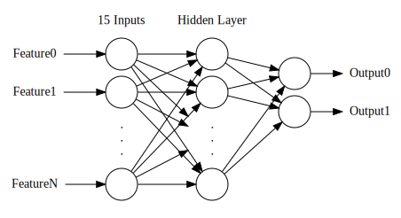
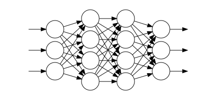
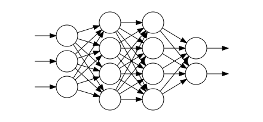
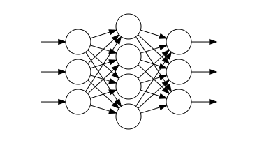
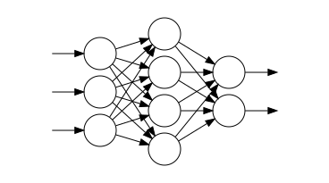

# Neural Network Graph

Neural Network graph written in dot

## How to generate .svg file

```bash
$ dot -Tsvg nn-n-n-2.dot -o svg/nn-n-n-2.svg
```

```bash
$ dot -Tsvg nn-3-4-4-3.dot -o svg/nn-3-4-4-3.svg
```

```bash
$ dot -Tsvg nn-3-4-4-2.dot -o svg/nn-3-4-4-2.svg
```


```bash
$ dot -Tsvg nn-3-4-3.dot -o svg/nn-3-4-3.svg
```


```bash
$ dot -Tsvg nn-3-4-2.dot -o svg/nn-3-4-2.svg
```










